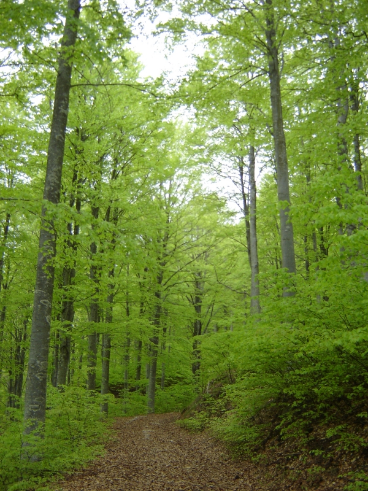

<strong>Il Lago Nero e L ’Alta Valle del Sestaione</strong>

Ci presentiamo: siamo la <strong>2°A</strong> della <em>Scuola Media Anna Frank</em>.

Abbiamo scelto di costruire uno strumento agile e di facile consultazione che possa essere utile ai turisti interessati a visitare questo magnifico angolo della provincia di Pistoia, ricco di storia, di paesaggi affascinanti, di specie vegetali e animali molto particolari e rare. Si tratta di una delle aree più pregiate dell’Appennino settentrionale che custodisce al suo interno popolamenti vegetali annoverati fra quelli di interesse conservazionistico dalla Direttiva Habitat del 1992.

Tutto è cominciato con l’incontro con il Dott. Simone Vergari, il quale ci ha introdotto a quella che sarebbe poi risultata un’esperienza unica, la passeggiata fino al Lago Nero. Quello che ci ha detto ci ha incuriosito e motivato quanto bastava perché, arrivati all’Orto Botanico dell’Abetone, non vedessimo l’ora di partire. E le aspettative sono state ampiamente superate da ciò che abbiamo visto, provato e imparato. Tutto il materiale raccolto, soprattutto fotografico, ci è servito, assieme a pubblicazioni particolari, ad allestire poi questo prodotto, su cui abbiamo lavorato a lungo.

L’area che abbiamo attraversato rientra nel perimetro del SIC (<em>Sito di Importanza Comunitaria</em>, Rete Natura 2000) IT5130001 Alta Valle del Sestaione. Molto vicino al sentiero che abbiamo percorso c’è la Riserva Statale di Campolino.

Una precisazione sui colori: useremo per i titoli il colore <strong>rosso</strong> per indicare i paragrafi di interesse storico – letterario, in <strong>azzurro</strong> quelli di interesse geografico – geomorfologico e in <strong>verde</strong> quelli di interesse ecologico – biologico.

